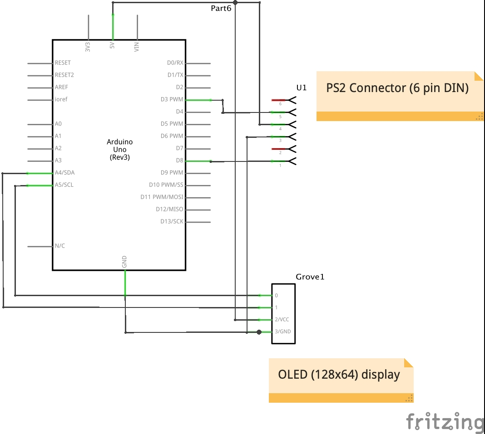
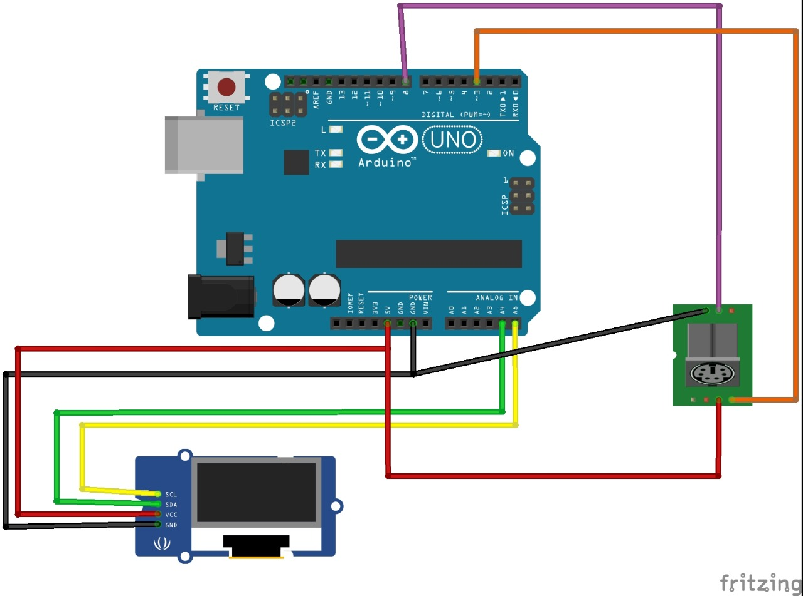

# Drawing Pictures (PS2 + Arduino)

## This is the list of components required for the given project:

### * Arduino UNO
### * PS2 Mouse
### * 12 V DC Adapter (recommended)
### * OLED display (I2C interface 128 x 64)
### * USB cable
### * 1.5 meter wire or 15 jumper cables 

## PS2 pin table:

## Expected out put:

# Schematic diagram:

# Bread board view:

